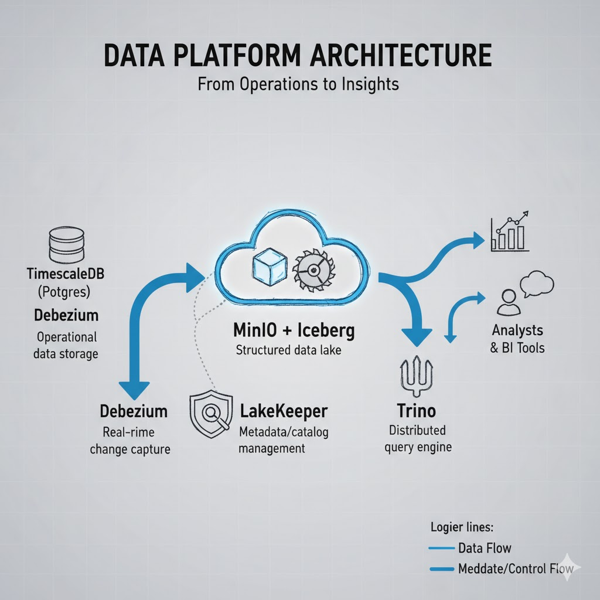

# 🧊 Realtime Lakehouse Stack

**End-to-end open-source data platform — from operational Postgres to actionable insights in Metabase, powered by Debezium, Apache Iceberg, Trino, and LakeKeeper.**



---

## 🚀 Overview

`realtime-lakehouse-stack` is a production-style data architecture built entirely with open-source components.  
It demonstrates how organizations can move **from raw operational data to real-time analytics** using modern data lakehouse technologies.

This stack simulates a complete data flow:

1. **Postgres (TimescaleDB)** — operational database capturing business transactions
2. **Debezium** — streams real-time changes from Postgres
3. **MinIO + Apache Iceberg** — scalable data lakehouse for structured, versioned data
4. **LakeKeeper** — metadata and governance for Iceberg tables
5. **Trino** — distributed SQL query engine for fast, interactive analysis
6. **Metabase** — self-service BI dashboards for decision-makers

---

## 🧱 Architecture at a Glance

| Component | Role in the Platform | Business Translation |
|------------|----------------------|----------------------|
| **TimescaleDB (Postgres)** | Operational data storage | Records all business operations reliably |
| **Debezium** | Real-time change capture | Automatically updates dashboards without manual ETL |
| **MinIO + Iceberg** | Structured data lake | Central repository of clean, queryable, scalable data |
| **LakeKeeper** | Metadata/catalog management | Teams always know what data exists and how to access it safely |
| **Trino** | Distributed query engine | Analysts and BI tools get fast access to large datasets |
| **Metabase** | BI dashboards | Converts data into actionable insights for executives |

---

## 💼 Why It Matters for Organizations

Modern companies need **real-time decision-making** based on operational data — not nightly batch ETL.  
This stack provides a **blueprint** for building your own in-house, cost-efficient, and open-source **data lakehouse** that can scale with business needs.

Use it to:
- Prototype modern data architectures
- Train data teams on streaming + lakehouse concepts
- Showcase end-to-end integration for consultancy or client pitches

---

## 🏗️ Quick Start

```bash
git clone https://github.com/yourusername/realtime-lakehouse-stack.git
cd realtime-lakehouse-stack
docker compose up -d
```
Once started:

- **Metabase** → http://localhost:3000  
- **Trino UI** → http://localhost:8080  
- **MinIO Console** → http://localhost:9001  
- **LakeKeeper API** → http://localhost:8181  

---

## 🤖 Data Transformation: From Raw Data to Business Insights with dbt

This is where the raw data from our operational systems is transformed into clean, reliable, and business-ready datasets. We use dbt (Data Build Tool), the industry standard for data transformation, to build our Bronze, Silver, and Gold data layers.

The dbt project is located in the `warehouse` directory and is pre-configured to connect to our Trino query engine, which reads from the Iceberg data lake.

### Running the dbt Models

Follow these steps to run the transformations that build our `silver` and `gold` tables:

1.  **Navigate to the dbt project directory:**
    This is the heart of our transformation logic.
    ```bash
    cd warehouse
    ```

2.  **Run the dbt transformations:**
    The following command executes all the dbt models. It uses the Python virtual environment (`.venv`) where dbt is installed and tells dbt to use the local `profiles.yml` for the Trino connection.
    ```bash
    ../.venv/bin/dbt run --profiles-dir .
    ```
    You will see dbt connect to Trino and build the `enriched_orders` (Silver) and `daily_sales` (Gold) tables in your Iceberg data lake.

    *Pro-tip: If you have the project's virtual environment activated in your shell (`source ../.venv/bin/activate`), you can simply run `dbt run --profiles-dir .`.*

This process is the key to turning the real-time change data captured by Debezium into actionable insights in Metabase.

---

## 🧪 Coming Next

- Airflow orchestration example  

---

## ⭐ Support the Project

If you find this stack helpful, please ⭐ **star the repository** and share it on LinkedIn!  
Your support helps promote open-source data platforms and real-time analytics innovation.

---

© 2025 — Built with ❤️ by Siddique Ahmad