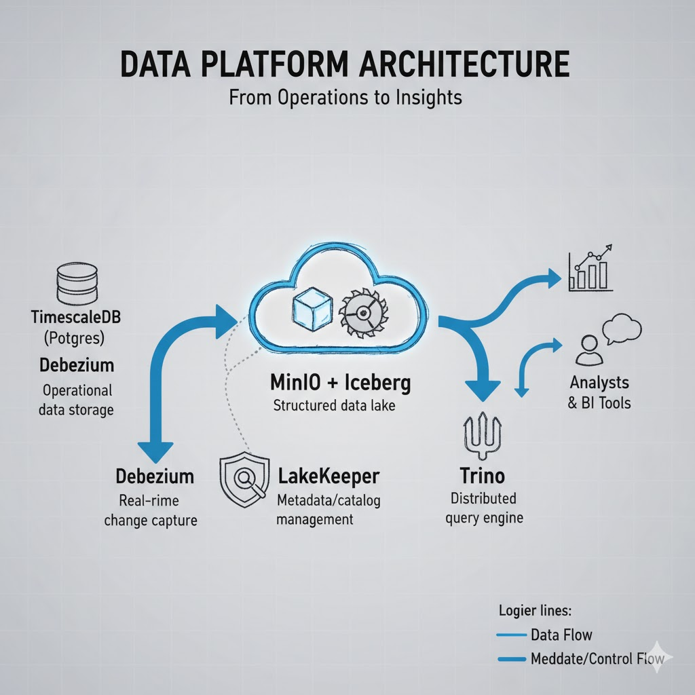

# 🏥 Realtime Healthcare Data Reliability Platform

**A HIPAA-aligned, real-time healthcare data platform — CDC reliability, data quality, lineage, minimum-necessary access, and AI-readiness, built entirely on open-source components.**



> **HIPAA-aligned, not "HIPAA compliant."** This repository implements the
> technical controls a HIPAA-regulated data flow needs — PHI classification,
> access control, audit-safe lineage, quality gating, de-identification. It
> is not, and cannot be, a compliance claim on its own: compliance depends on
> the complete administrative, physical, and contractual environment around
> the software, not the software alone. See [`docs/hipaa_alignment.md`](docs/hipaa_alignment.md).
>
> **All data in this repository is synthetic.** No real patient information
> is stored, transmitted, or referenced anywhere in this codebase.

---

## 🚀 Overview

This stack simulates an EHR's operational data flowing through change data
capture into a governed lakehouse:

1. **Postgres (TimescaleDB)** — operational EHR: `Patient → Encounter →
   {Diagnosis, Procedure, LabResult, Observation}`, plus `Provider` and
   `Facility`.
2. **Debezium** — streams row-level changes out of Postgres in real time.
3. **Apache Iceberg (via a Lakekeeper REST catalog + MinIO)** — immutable,
   versioned raw CDC history.
4. **dbt reliability engine (bronze)** — idempotent, ordering-safe,
   delete-aware CDC processing.
5. **dbt data quality gates (silver → quality)** — completeness, validity,
   referential integrity, and clinical plausibility checks split records
   into **trusted** vs **quarantine**.
6. **De-identification (deid)** — a Safe-Harbor-*style* path to analytics-safe
   data, separate from the PHI-carrying layers.
7. **Trino / DuckDB** — query trusted, de-identified, and aggregate data.
8. **Metabase** — BI dashboards on top of Trino.

## 🧭 The north star

```
HEALTHCARE SOURCE
   PostgreSQL/EHR
        │
       CDC (Debezium)
        │
        ▼
  RAW ICEBERG DATA  ── immutable append-only CDC history
        │
        ▼
 RELIABILITY ENGINE  ── dedup / idempotency, ordering, delete handling
   (bronze, macros/cdc_reliability.sql)
        │
        ▼
  DATA QUALITY GATES  ── completeness, validity, referential integrity,
   (silver, macros/data_quality.sql)   clinical plausibility
        │
   ┌────┴────┐
   ▼         ▼
TRUSTED   QUARANTINE
   │
   ▼
DE-IDENTIFICATION (Safe-Harbor-style) ──► deid / gold (aggregate)
   │
   ▼
Trino / DuckDB ──► Analytics / AI, under minimum-necessary access
```

Lineage (`record_token`, `source_event_id`, `pipeline_run_id`,
`quality_status`) and access control run through every layer — see
[Governance & PHI](#-governance--phi) below — rather than being bolted on at
the end.

## 🏗️ Domain model

```
Patient
   ├── Encounter
   │      ├── Diagnosis
   │      ├── Procedure
   │      └── (Provider, Facility)
   ├── Medication
   ├── Lab Result
   └── Observation
```

Seeded as synthetic data in `infra-setup/timescale/healthcare.sql`.

## 📚 Layers

| Layer | Location | Purpose |
|---|---|---|
| Raw CDC | `icebergdata.debeziumcdc_dbz__ehr_*` | Immutable event history landed by Debezium |
| Bronze | `warehouse/models/bronze/` | Reliability engine: dedup, ordering, soft deletes → current state per key |
| Silver | `warehouse/models/silver/` | Data quality gates → `quality_status` + `failed_checks` + lineage |
| Quality | `warehouse/models/quality/` | `trusted_*` / `quarantine_*` split by `quality_status` |
| De-identified | `warehouse/models/deid/` | Safe-Harbor-style transform of trusted data |
| Gold | `warehouse/models/gold/` | Aggregate-only analytics + observability (freshness, CDC lag, volume, quality pass rate) |

## 📈 Observability

Four gold models answer "is the pipeline healthy?" without exposing any
PHI-classified column — counts, timestamps, and run ids only. Each has a
precise, deliberately-not-interchangeable definition (see each model's own
docstring for the reasoning):

| Model | Answers |
|---|---|
| `gold.cdc_freshness` | For the most-recently-processed event per dataset: how long did it take to land in bronze (`cdc_lag_seconds`), and how long ago was that (`staleness_seconds`)? Both measured from the same row, not two independently-maxed timestamps. |
| `gold.cdc_volume_summary` | Raw CDC event volume split into unique vs. *duplicate* events (a literal redelivery — same natural key **and** LSN — not just "another update"), by operation type, against the current row count, plus each as a rate (`duplicate_rate_pct`/`insert_rate_pct`/`update_rate_pct`/`delete_rate_pct`, summing to ~100%). |
| `gold.data_quality_summary` | Pass/fail record counts per dataset, **per pipeline run** — how did a specific run's batch look. |
| `gold.current_quality_summary` | PASS rate per dataset, **right now** — computed directly off the live silver population, not by summing across runs. |

These read `pipeline_run_id`/`cdc_source_ts_ns`/`_loaded_at` — already
computed once per row by the reliability engine (`macros/cdc_reliability.sql`)
— rather than adding a separate metrics-collection mechanism.

### Operational lineage: "why is this record in the state it's in?"

`gold.record_lineage` traces one record's whole journey — CDC event →
processing run → quality decision → trusted/quarantine — for the 4 fully
quality-gated entities (patients, encounters, diagnoses, lab_results):

```
Patient record
     │
CDC event (source_event_id: which transaction/LSN produced this version)
     │
Processing (pipeline_run_id: which dbt run merged it into bronze)
     │
Quality decision (quality_status / failed_checks)
     │
 ┌───┴────┐
 ▼        ▼
trusted quarantine   (or neither, if deleted before a decision was made)
```

Keyed on `record_token`, not the natural key — PHI-free, so an analyst or
an AI agent can investigate *why* a record was quarantined without
touching a clinical value, escalating to a `clinical_user`/`data_engineer`
(who can resolve `record_token` back to the underlying row under their own
tier's access) only if the investigation actually needs the PHI itself.

## 🔐 Governance & PHI

- [`governance/phi_classification.yml`](governance/phi_classification.yml) —
  column-level PHI/sensitivity classification and the minimum-necessary
  role → access matrix (`data_engineer`, `analyst`, `clinical_user`,
  `ai_agent`).
- [`infra-setup/trino/rules.json`](infra-setup/trino/rules.json) — Trino
  file-based access control implementing that matrix.
  **⚠️ Not enabled by default.** `docker compose up` runs Trino wide open —
  the rules only take effect once you copy
  `infra-setup/trino/access-control.properties.example` to
  `access-control.properties` and restart Trino (see that file's header).
  Until you do, minimum-necessary access is a policy this repo *can*
  enforce, not one the running stack *is* enforcing.
- Lineage/observability metadata (`record_token`, `source_event_id`,
  `pipeline_run_id`) is HMAC-keyed (not a plain hash — see
  `docs/lineage_token_rotation.md` for why that matters and how to set
  `RECORD_TOKEN_HMAC_KEY`) and carries no PHI values — see
  `warehouse/macros/lineage.sql` and the "lineage safety
  rules" in the PHI registry.

## 🧪 Reliability test suite

[`reliability-tests/`](reliability-tests/) exercises 12 scenarios — duplicate
events, out-of-order delivery, deletes, invalid references, impossible
clinical values, missing fields, unauthorized access, replay, and outage
recovery — against the questions this platform needs to answer:

> Did we preserve the correct clinical state? Can we prove where it came
> from? Can we prove which quality checks it passed? Can we identify who
> accessed it? Can we replay the pipeline safely?

[`.github/workflows/ci.yml`](.github/workflows/ci.yml) runs `dbt parse`, JSON
validation, and 4 of the 12 scenarios against a real Postgres service
container on every PR.
[`.github/workflows/e2e-pipeline.yml`](.github/workflows/e2e-pipeline.yml)
runs the actual `docker compose` stack (Debezium → Iceberg → dbt → Trino)
and asserts scenarios 01–08's outcomes — dedup, ordering, deletes,
referential integrity, clinical plausibility, completeness, quarantine, and
minimum-necessary access control (as 4 different Trino identities) — through
the real reliability engine and Trino's file-based access control, not just
at the source. But it's nightly/on-demand, not a PR gate, and its
first real runs are still shakeout (see "What's actually automated in CI" in
`reliability-tests/README.md` for the honest version of what's proven vs.
what's aspirational).

---

## 🏗️ Quick Start

```bash
git clone https://github.com/yourusername/realtime-lakehouse-stack.git
cd realtime-lakehouse-stack/infra-setup
docker compose up -d
```

Once started:

- **Metabase** → http://localhost:3000
- **Trino UI** → http://localhost:8080
- **MinIO Console** → http://localhost:9001
- **LakeKeeper API** → http://localhost:8181

## 🤖 Data Transformation with dbt

The dbt project lives in `warehouse/` and is configured to connect to Trino,
which reads the Iceberg lake.

```bash
uv sync                       # once, from the repo root
cd warehouse
../.venv/bin/dbt seed --profiles-dir .   # loads seeds/lab_reference_ranges.csv
../.venv/bin/dbt run  --profiles-dir .   # builds bronze → silver → quality → deid → gold
../.venv/bin/dbt test --profiles-dir .   # runs schema/data tests
```

*Pro-tip: `source .venv/bin/activate` once, then drop the `../.venv/bin/`
prefix.*

---

## 🧪 Coming Next

- Airflow orchestration example
- Expert Determination workflow for de-identified data
- Row/column-level audit logging of PHI access

## ⭐ Support the Project

If you find this stack helpful, please ⭐ **star the repository** and share it on LinkedIn!

---

© 2025–2026 — Built with ❤️ by Siddique Ahmad
