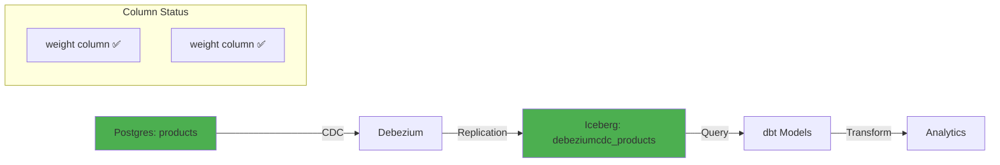
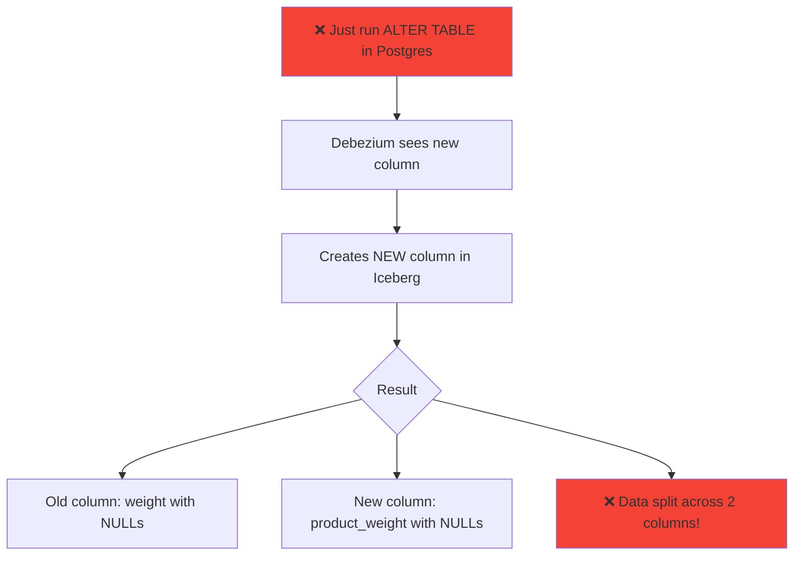
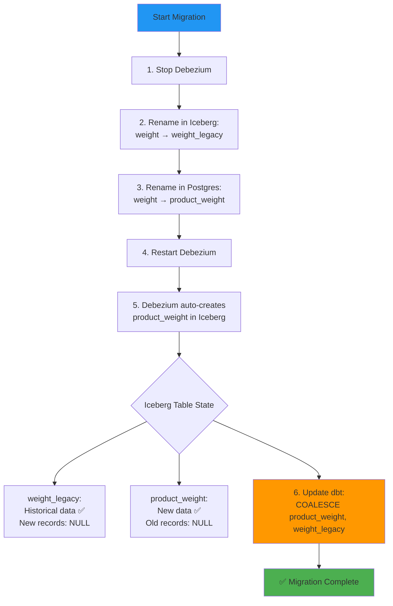
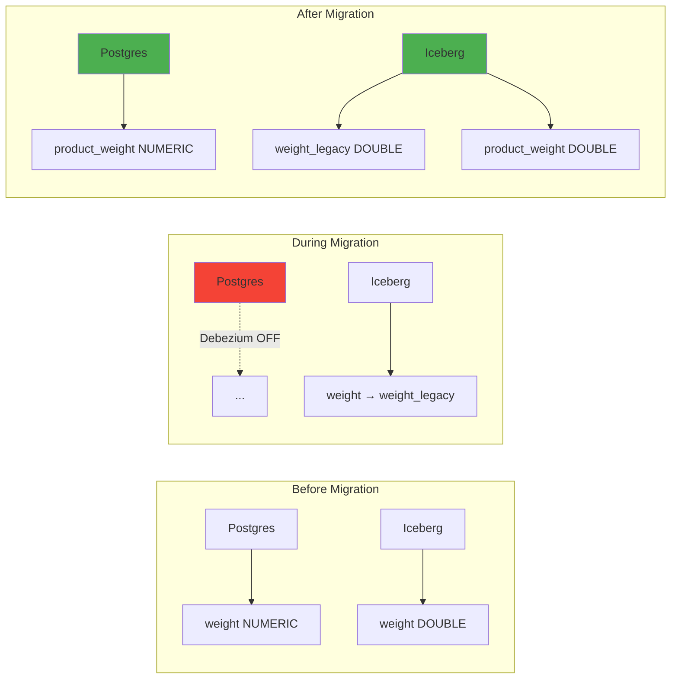
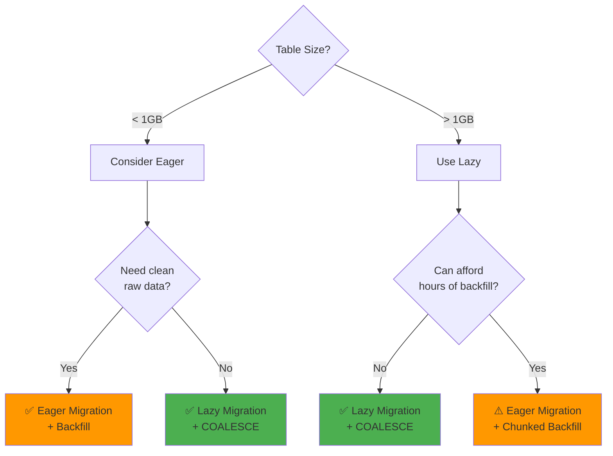
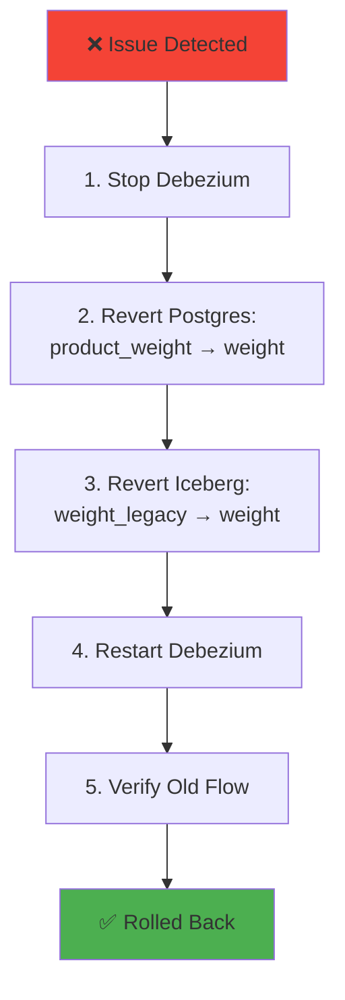

# Migration 002: Visual Flow Diagram

## Data Flow - Before Migration



---

## ⚠️ What Happens WITHOUT Proper Migration



---

## ✅ Correct Migration Flow



---

## Migration Timeline

```mermaid
gantt
    title Migration 002 Execution Timeline
    dateFormat  HH:mm
    axisFormat %H:%M
    
    section Preparation
    Review Scripts           :done, prep1, 00:00, 30m
    Test in Staging         :done, prep2, after prep1, 30m
    
    section Downtime Window
    Stop Debezium           :crit, down1, after prep2, 1m
    Iceberg Migration       :crit, down2, after down1, 1m
    Postgres Migration      :crit, down3, after down2, 1m
    Restart Debezium        :crit, down4, after down3, 1m
    
    section Verification
    Verify Data Flow        :active, verify1, after down4, 10m
    
    section dbt Updates
    Update Models           :dbt1, after verify1, 45m
    Run dbt Tests           :dbt2, after dbt1, 15m
```



**Total Downtime: ~4 minutes** (Debezium stopped)

---

## Schema Evolution



---

## dbt Query Pattern

### Before Migration
```sql
SELECT
  id,
  name,
  weight,  -- ❌ Single column
  price
FROM {{ source('iceberg', 'debeziumcdc_products') }}
```

### After Migration (Lazy Strategy)
```sql
SELECT
  id,
  name,
  COALESCE(product_weight, weight_legacy) AS product_weight,  -- ✅ Handles both
  price
FROM {{ source('iceberg', 'debeziumcdc_products') }}
```

### After Eager Backfill (Optional)
```sql
SELECT
  id,
  name,
  product_weight,  -- ✅ Single column (after backfill)
  price
FROM {{ source('iceberg', 'debeziumcdc_products') }}
```

---

## Decision Tree: Lazy vs Eager



---

## Rollback Procedure



---

## Files Generated

```
migrations/
├── 002_rename_weight_column.sql       # Postgres migration
├── iceberg_migration_002.sql          # Iceberg schema change
├── dbt_migration_002.sql              # dbt update guide
├── MIGRATION_002_SUMMARY.md           # Full documentation (this file)
└── execute_migration_002.sh           # Interactive execution script
```

---

## Quick Reference Commands

### Execute Migration
```bash
# Interactive guided migration
./migrations/execute_migration_002.sh

# Manual execution
docker-compose stop debezium
# Run Iceberg migration in Trino/Spark
psql -h localhost -U testuser -d inventory -f migrations/002_rename_weight_column.sql
docker-compose start debezium
```

### Verify Migration
```sql
-- Postgres
\d+ inventory.products

-- Iceberg (Trino/Spark)
DESCRIBE iceberg.icebergdata.debeziumcdc_products;
```

### Update dbt
```bash
# Find models to update
grep -r "weight" dbt_project/models/

# Run updated models
dbt run --select +products
dbt test --select +products
```

---

**Generated:** 2026-01-26  
**Schema Evaluator Skill Version:** 1.0  
**Next Steps:** Follow [MIGRATION_002_SUMMARY.md](file:///Users/siddiqueahmad/projects/realtime-lakehouse-stack/migrations/MIGRATION_002_SUMMARY.md)
